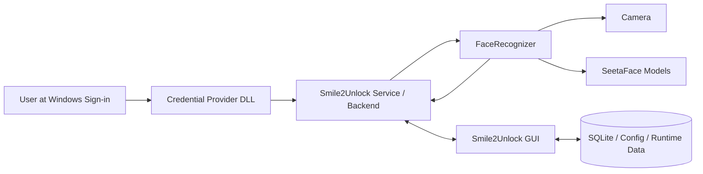
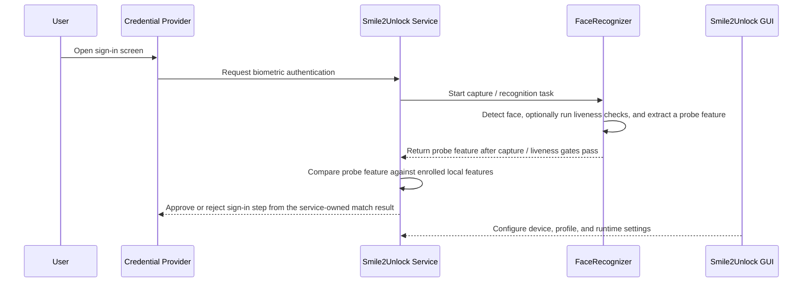
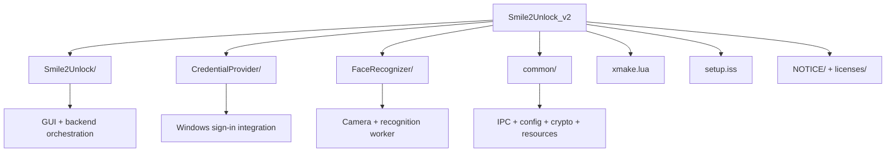

# Smile2Unlock

<p align="center">
  
</p>

<h3 align="center">A modern Windows face-unlock prototype built on Credential Provider, local IPC, and SeetaFace.</h3>

<p align="center">
  <a href="#overview">Overview</a> •
  <a href="#installation-usage">Installation & Usage</a> •
  <a href="#architecture">Architecture</a> •
  <a href="#building-from-source">Building from Source</a> •
  <a href="#screenshots">Screenshots</a> •
  <a href="#security-notice">Security Notice</a> •
  <a href="README_zh.md">简体中文</a>
</p>

<p align="center">
  
  
  
  
  
</p>

## Overview

Smile2Unlock is a Windows biometric login project that experiments with a custom face-authentication flow on top of the Windows Credential Provider model.

Instead of being only a single app, the repository is organized as a small system:

- `Smile2Unlock`: the desktop GUI and orchestration layer
- `SampleV2CredentialProvider.dll`: the Windows Credential Provider integration
- `FaceRecognizer`: the camera, optional liveness checks, and feature extraction worker
- `common`: shared models, config, crypto, IPC, assets, and language resources

The current codebase already includes:

- Face capture and feature extraction
- Liveness detection via SeetaFace anti-spoofing
- A Windows login integration path through Credential Provider
- Local IPC between GUI / service / recognizer components
- An installer script for packaging and registration

## Installation & Usage

For most users, the easiest way to get started is to download the pre-built installer from the [Releases](https://github.com/Smile2Unlock/Smile2Unlock_v2/releases) page.

### Step 1: Download and Install
1. Go to the [Releases](https://github.com/Smile2Unlock/Smile2Unlock_v2/releases) page
2. Download the latest `Smile2Unlock-Setup.exe` installer
3. Run the installer with administrator privileges (required for Credential Provider registration)
4. Follow the installation wizard

### Step 2: Set Up Your Face
1. After installation, launch **Smile2Unlock** from the Start Menu or desktop shortcut
2. Go to the **Enrollment** tab
3. Click **"Add User"** to create a new user account
4. Click **"Capture Face"** to enroll your facial features
5. You can enroll multiple faces for different lighting conditions or angles

### Step 3: Use Face Unlock
1. Lock your Windows session (Win+L) or restart your computer
2. At the Windows login screen, you should see the Smile2Unlock credential provider tile
3. Look at your camera - the system will automatically detect your face and unlock
4. If face recognition fails, you can still use your password by clicking "Sign-in options"

### Troubleshooting
- **Camera not detected**: Ensure your camera is properly connected and drivers are installed
- **Face not recognized**: Try re-enrolling your face in better lighting conditions
- **Password error**: Use your user password instead of PIN. If you use a Microsoft account, try entering your Microsoft account email as the username when registering in Smile2Unlock
- **Credential Provider not appearing**: Try rebooting or re-running the installer as administrator

## Highlights

| Capability | Notes |
| --- | --- |
| Windows login integration | Uses a custom Credential Provider DLL for Winlogon sign-in flow |
| Split-process design | GUI, service, and recognition worker are separated for cleaner responsibilities |
| Shared-memory + UDP IPC | Supports image sharing, preview streaming, probe-feature delivery, and status messaging |
| Local persistence | Uses SQLite plus config/runtime directories for local state |
| Modern C++ toolchain | Built with `xmake`, `clang`, `llvm-mingw`, and C++26 modules |

## Architecture



### Sign-in flow



### Runtime roles

- `SampleV2CredentialProvider.dll` plugs into the Windows authentication surface.
- `Smile2Unlock.exe --service` acts as the privileged backend / IPC host.
- `Smile2Unlock.exe` without `--service` launches the GUI and can connect to an already-running backend.
- `FaceRecognizer.exe` handles camera-oriented recognition tasks such as one-shot capture, preview streaming, liveness checks, and feature extraction. The service owns login-time feature comparison and decides whether CP receives final success.

<details>
<summary>Why the project is split this way</summary>

This layout helps keep Windows sign-in integration, GUI behavior, and recognition execution relatively isolated. That makes it easier to debug the login flow, evolve the recognizer separately, and avoid tying camera-heavy logic directly into the provider DLL.

</details>

## Project Structure

```text
.
|-- Smile2Unlock/          # Main GUI app, backend service, runtime orchestration
|-- CredentialProvider/    # Windows Credential Provider DLL
|-- FaceRecognizer/        # Recognition worker, camera capture, SeetaFace integration
|-- common/                # Shared models, modules, IPC helpers, resources
|-- local-repo/            # Local xmake package repository
|-- licenses/              # Third-party license texts
|-- NOTICE/                # Third-party notices
|-- setup.iss              # Inno Setup installer script
`-- xmake.lua              # Primary build entry
```

### Repository map



## Tech Stack

- Windows Credential Provider API
- SeetaFace 6
- SQLite3
- GLFW + Dear ImGui
- Boost
- Mbed TLS
- libyuv
- xmake
- clang + llvm-mingw

## Building from Source

*This section is for developers and users who want to build from source. Most users should use the pre-built installer from the [Releases](https://github.com/Smile2Unlock/Smile2Unlock_v2/releases) page.*

### Requirements

- Windows 10 or later
- `xmake`
- `llvm-mingw-ucrt-x86_64`
- A working camera
- Administrator privileges for installation / Credential Provider registration

### Build

```powershell
xmake f -y -c -p mingw -a x86_64 --mingw="D:\Tools\llvm-mingw-ucrt-x86_64" --sdk="D:\Tools\llvm-mingw-ucrt-x86_64" --toolchain=clang --runtimes=c++_static
xmake require --build -f -y seetaface6open
xmake build
```

### Build outputs

The main targets defined in [`xmake.lua`](xmake.lua) are:

- `Smile2Unlock`
- `FaceRecognizer`
- `SampleV2CredentialProvider.dll`

### Running locally

Launch the GUI:

```powershell
.\build\mingw\x86_64\release\Smile2Unlock.exe
```

Launch backend service mode:

```powershell
.\build\mingw\x86_64\release\Smile2Unlock.exe --service
```

Inspect recognizer CLI help:

```powershell
.\build\mingw\x86_64\release\FaceRecognizer.exe --help
```

### Creating an Installer

The repository includes an Inno Setup script at [`setup.iss`](setup.iss) that can be used to create a distributable installer. This is useful for developers who want to package their own builds:

- Build the project using the instructions above
- Run Inno Setup with `setup.iss` to create `Smile2Unlock-Setup.exe`
- The generated installer will:
  - Copy the application files
  - Deploy `SampleV2CredentialProvider.dll` into `System32`
  - Register the Credential Provider CLSID
  - Install with administrator privileges

Most users should download the pre-built installer from the [Releases](https://github.com/Smile2Unlock/Smile2Unlock_v2/releases) page instead of building their own.

## Screenshots

<p align="center">
  
</p>

<p align="center">
  
  
</p>

## Showcase

This section highlights the Windows login side of the project:

<p align="center">
  
</p>

<p align="center">
  
</p>

## FaceRecognizer CLI

`FaceRecognizer` already exposes several useful modes:

- `recognize`
- `capture-image`
- `preview-stream`
- `compare-features`

Typical entry point:

```powershell
.\FaceRecognizer.exe --mode recognize --camera 0 --liveness-detection=true
```

For service-launched recognition, boolean options are passed with explicit values, for example `--liveness-detection=false`. In the sign-in flow, `recognize` emits a probe feature after capture and optional liveness checks; `Smile2Unlock.exe --service` compares that feature with enrolled local features before forwarding final success or failure to the Credential Provider.

## Status

This repository is best understood as a serious prototype / experimental system rather than a production-ready authentication product.

Areas that still deserve continued hardening include:

- deployment ergonomics
- operational logging and diagnostics
- failure recovery around camera / IPC / login edge cases
- security review and threat modeling
- test coverage for sensitive authentication paths

## Security Notice

This project touches Windows authentication surfaces and processes biometric data locally. Review the code carefully before using it beyond research, experimentation, or controlled environments.

You should assume that production deployment requires:

- a dedicated security review
- credential-provider-specific validation
- anti-spoofing evaluation
- secure storage and lifecycle rules for biometric material
- rollback and recovery planning in case of failed login integrations

## License

This project is licensed under the [MIT License](LICENSE).

Third-party attributions and notices are available in:

- [NOTICE/THIRD-PARTY-NOTICES.md](NOTICE/THIRD-PARTY-NOTICES.md)
- [`licenses/`](licenses)

## Contributing

Contributions are welcome, especially around:

- installer polish
- recognizer robustness
- documentation and diagrams
- testing and reproducible setup

If you introduce a new dependency, please keep its license and attribution information in sync with the existing notices.

## Contributors

<p align="center">
  <a href="https://github.com/aurorae114514">
    
  </a>
  <a href="https://github.com/dullspear">
    
  </a>
  <a href="https://space.bilibili.com/1258455455">
    
  </a>
</p>

<p align="center">
  <a href="https://github.com/aurorae114514"><strong>ation_ciger</strong></a> •
  <a href="https://github.com/dullspear"><strong>dullspear</strong></a> •
  <a href="https://space.bilibili.com/1258455455"><strong>YAUE</strong></a>
</p>

<p align="center">
  <a href="https://github.com/Smile2Unlock/Smile2Unlock_v2/graphs/contributors">
    
  </a>
</p>
