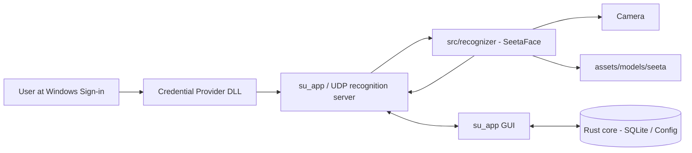
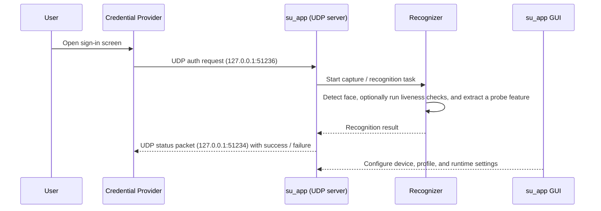
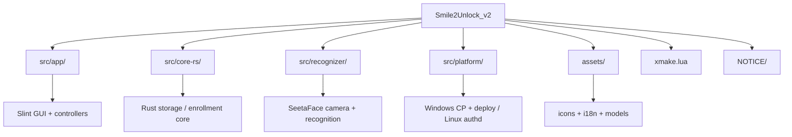

# Smile2Unlock

<p align="center">
  
</p>

<h3 align="center">A modern Windows face-unlock prototype built on Credential Provider, local IPC, and SeetaFace.</h3>

<p align="center">
  <a href="#overview">Overview</a> •
  <a href="#installation-usage">Installation & Usage</a> •
  <a href="#architecture">Architecture</a> •
  <a href="#building-from-source">Building from Source</a> •
  <a href="#screenshots">Screenshots</a> •
  <a href="#security-notice">Security Notice</a> •
  <a href="README_zh.md">简体中文</a>
</p>

<p align="center">
  
  
  
  
  
</p>

## Overview

Smile2Unlock is a Windows biometric login project that experiments with a custom face-authentication flow on top of the Windows Credential Provider model.

Instead of being only a single app, the repository is organized as a small system:

- `su_app`: the Slint desktop GUI and orchestration layer
- `su_authd` (Linux) / Credential Provider (Windows): the sign-in integration
- `su_deploy_helper`: the privileged deployment helper (UAC on Windows, D-Bus/Polkit on Linux)
- `src/recognizer`: camera capture, liveness checks, and SeetaFace feature extraction
- `assets/`: the single repository-wide resource folder (icons, i18n, SeetaFace models)

The current codebase already includes:

- Face capture and feature extraction
- Liveness detection via SeetaFace anti-spoofing
- A Windows login integration path through Credential Provider
- UDP recognition server for the sign-in flow, plus local IPC between GUI / service components
- In-app deployment (Credential Provider registration, service management) with UAC elevation

## Installation & Usage

### Step 1: Deploy the app

Copy the build output (`su_app.exe`, `su_deploy_helper.exe`, and the `assets/` folder next to it) to a folder on the target machine, for example `C:\su-deploy\bin\`.

### Step 2: Set Up Your Face
1. Launch **Smile2Unlock** (`su_app.exe`) from the deployment folder
2. Go to the **Enrollment** tab
3. Click **"Add User"** to create a new user account
4. Click **"Capture Face"** to enroll your facial features
5. You can enroll multiple faces for different lighting conditions or angles

### Step 3: Enable Face Unlock
1. Open the **Deployment** panel inside the app and click **Install** (a UAC prompt will appear — the deployment helper performs Credential Provider registration and service setup)
2. Lock your Windows session (Win+L) or restart your computer
3. At the Windows login screen, you should see the Smile2Unlock credential provider tile
4. Look at your camera - the system will automatically detect your face and unlock
5. If face recognition fails, you can still use your password by clicking "Sign-in options"

### Troubleshooting
- **Camera not detected**: Ensure your camera is properly connected and drivers are installed
- **Face not recognized**: Try re-enrolling your face in better lighting conditions
- **Password error**: Use your user password instead of PIN. If you use a Microsoft account, try entering your Microsoft account email as the username when registering in Smile2Unlock
- **Credential Provider not appearing**: Try rebooting or re-running the installer as administrator

## Highlights

| Capability | Notes |
| --- | --- |
| Windows login integration | Uses a custom Credential Provider DLL for Winlogon sign-in flow |
| Split-process design | GUI, privileged deployment helper, and recognition worker are separated |
| UDP + socket IPC | UDP recognition server for the sign-in flow, control socket for GUI IPC |
| Local persistence | Rust core with SQLite-backed plaintext/encrypted stores |
| Modern toolchain | Built with `xmake`, `g++` (mingw / native), C++26 modules, Rust, Zig, and Slint |

## Architecture


```mermaid
flowchart LR
    U[User at Windows Sign-in] --> CP[Credential Provider DLL]
    CP --> S[su_app / UDP recognition server]
    S --> R[src/recognizer - SeetaFace]
    S <--> GUI[su_app GUI]
    GUI <--> CORE[(Rust core - SQLite / Config)]
    R --> CAM[Camera]
    R --> MODEL[assets/models/seeta]
    R --> S
```

### Sign-in flow


```mermaid
sequenceDiagram
    participant User
    participant CP as Credential Provider
    participant S as su_app (UDP server)
    participant R as Recognizer
    participant GUI as su_app GUI

    User->>CP: Open sign-in screen
    CP->>S: UDP auth request (127.0.0.1:51236)
    S->>R: Start capture / recognition task
    R->>R: Detect face, optionally run liveness checks, and extract a probe feature
    R-->>S: Recognition result
    S-->>CP: UDP status packet (127.0.0.1:51234) with success / failure
    GUI-->>S: Configure device, profile, and runtime settings
```

### Runtime roles

- `su_deploy_helper.exe` (Windows, UAC) / `su_deploy_helper` (Linux, D-Bus/Polkit) performs privileged deployment: Credential Provider registration, service installation.
- `su_app` hosts the GUI, profile management (enroll/list/delete via the Rust core), the UDP recognition server, and the deployment panel.

<details>
<summary>Why the project is split this way</summary>

This layout helps keep Windows sign-in integration, GUI behavior, and recognition execution relatively isolated. That makes it easier to debug the login flow, evolve the recognizer separately, and avoid tying camera-heavy logic directly into the provider DLL.

</details>

## Project Structure

```text
.
|-- src/                   # All source code
|   |-- app/               # su_app GUI entry + controllers (per-platform)
|   |-- modules/           # C++26 modules (su.core.types, su.app.*, su.recognizer.*)
|   |-- core-rs/           # Rust core (storage, enrollment, encryption)
|   |-- recognizer/        # SeetaFace backend, camera, image pipeline
|   |-- platform/          # Windows (CP, UDP server, deploy) / Linux (authd, deploy)
|   `-- zig/               # Zig components
|-- assets/                # Single resource folder: icons/, i18n/, models/seeta/
|-- docs/                  # Design docs
|-- packaging/             # Linux packaging (package.sh, systemd, dbus, polkit)
|-- local-repo/            # Local xmake package repository
|-- NOTICE/                # Third-party notices
`-- xmake.lua              # Primary build entry
```

### Repository map


```mermaid
flowchart TD
    ROOT[Smile2Unlock_v2]
    ROOT --> APP[src/app/]
    ROOT --> CORE[src/core-rs/]
    ROOT --> REC[src/recognizer/]
    ROOT --> PLAT[src/platform/]
    ROOT --> ASSETS[assets/]
    ROOT --> BUILD[xmake.lua]
    ROOT --> NOTICE[NOTICE/]

    APP --> APP1[Slint GUI + controllers]
    CORE --> CORE1[Rust storage / enrollment core]
    REC --> REC1[SeetaFace camera + recognition]
    PLAT --> PLAT1[Windows CP + deploy / Linux authd]
    ASSETS --> ASSETS1[icons + i18n + models]
```

## Tech Stack

- Windows Credential Provider API
- Slint (UI)
- SeetaFace 6
- SQLite3
- C++26 modules
- Rust (core storage / enrollment, credential provider helper)
- Zig (platform components)
- libyuv
- xmake
- g++ (mingw for Windows, native for Linux)

## Building from Source

*This section is for developers and users who want to build from source.*

### Requirements

- Windows 10 or later
- `xmake`
- A MinGW-w64 toolchain (`g++` with C++26 module support, e.g. mingw-w64-gcc 14+)
- A working camera
- Administrator privileges for installation / Credential Provider registration

### Build

```powershell
xmake f -y -c -p mingw -a x86_64
xmake require --build -f -y seetaface6open
xmake build
```

The Windows Credential Provider (`su_credential_provider.dll`) is built from Rust:

```powershell
cargo build --release --target x86_64-pc-windows-gnu --manifest-path src\platform\windows\credential_provider_rs\Cargo.toml
```

### Build outputs

The main targets defined in [`xmake.lua`](xmake.lua) are:

- `su_app` (Windows: `su_app.exe`) — the Slint GUI
- `su_deploy_helper` (Windows: `su_deploy_helper.exe`) — the privileged deployment helper
- `su_authd` (Linux only) — the auth daemon
- `su_credential_provider.dll` (Windows only, Rust) — the Credential Provider

### Running locally

Launch the GUI (Windows):

```powershell
.\build\mingw\x86_64\release\su_app.exe
```

### Creating an Installer

On Linux, run [`packaging/linux/package.sh`](packaging/linux/package.sh) to produce `tar.gz` / `pacman` / `deb` / `rpm` packages:

```bash
packaging/linux/package.sh --format all
```

The generated packages include `su_app`, `su_authd`, `su_deploy_helper`, the PAM module, and the resources staged from `assets/` (i18n and SeetaFace models) into `/usr/share/smile2unlock/`.

Most users should use the packaged release instead of building their own.

## Screenshots

<p align="center">
  
</p>

<p align="center">
  
  
</p>

## Showcase

This section highlights the Windows login side of the project:

<p align="center">
  
</p>

<p align="center">
  
</p>

## Sign-in flow details

In the Windows sign-in flow, the Credential Provider sends a UDP auth request to `su_app` (port 51236). `su_app` runs face capture, optional liveness checks, and feature extraction through the SeetaFace backend, compares the probe against enrolled local features, and reports the result back to the Credential Provider via the status channel (port 51234).

## Status

This repository is best understood as a serious prototype / experimental system rather than a production-ready authentication product.

Areas that still deserve continued hardening include:

- deployment ergonomics
- operational logging and diagnostics
- failure recovery around camera / IPC / login edge cases
- security review and threat modeling
- test coverage for sensitive authentication paths

## Security Notice

This project touches Windows authentication surfaces and processes biometric data locally. Review the code carefully before using it beyond research, experimentation, or controlled environments.

You should assume that production deployment requires:

- a dedicated security review
- credential-provider-specific validation
- anti-spoofing evaluation
- secure storage and lifecycle rules for biometric material
- rollback and recovery planning in case of failed login integrations

## License

This project is licensed under the [MIT License](LICENSE).

Third-party attributions and notices are available in:

- [NOTICE/THIRD-PARTY-NOTICES.md](NOTICE/THIRD-PARTY-NOTICES.md)
- [`licenses/`](licenses)

## Contributing

Contributions are welcome, especially around:

- installer polish
- recognizer robustness
- documentation and diagrams
- testing and reproducible setup

If you introduce a new dependency, please keep its license and attribution information in sync with the existing notices.

## Contributors

<p align="center">
  <a href="https://github.com/aurorae114514">
    
  </a>
  <a href="https://github.com/dullspear">
    
  </a>
  <a href="https://space.bilibili.com/1258455455">
    
  </a>
</p>

<p align="center">
  <a href="https://github.com/aurorae114514"><strong>ation_ciger</strong></a> •
  <a href="https://github.com/dullspear"><strong>dullspear</strong></a> •
  <a href="https://space.bilibili.com/1258455455"><strong>YAUE</strong></a>
</p>

<p align="center">
  <a href="https://github.com/Smile2Unlock/Smile2Unlock_v2/graphs/contributors">
    
  </a>
</p>
