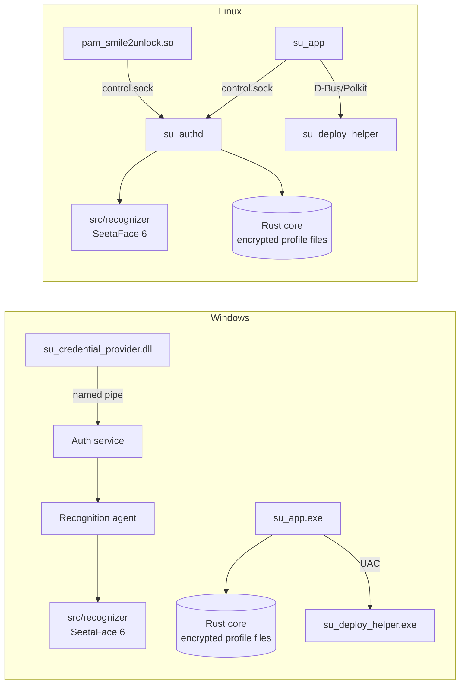

# Smile2Unlock

<p align="center">
  
</p>

<h3 align="center">Local face authentication · Windows sign-in integration + Linux PAM</h3>

<p align="center">
  <a href="#overview">Overview</a> •
  <a href="#platforms">Platforms</a> •
  <a href="#deployment">Deployment</a> •
  <a href="#architecture">Architecture</a> •
  <a href="#repository-layout">Repository</a> •
  <a href="#building">Building</a> •
  <a href="#contributors">Contributors</a> •
  <a href="README_zh.md">简体中文</a>
</p>

<p align="center">
  
  
  
  
  
</p>

## Overview

Smile2Unlock is a local face-authentication system: all face features are extracted and matched on-device (SeetaFace 6), with no cloud dependency. It ships as two platform variants:

- **Windows**: integrates into the Winlogon sign-in surface (lock screen, UAC) via a Credential Provider
- **Linux**: plugs into `login` / GDM / SDDM authentication via a PAM module

Both platforms share the same core: a recognition pipeline written with C++26 modules, a Rust face-profile store (plaintext and encrypted backends), a Slint GUI, and the xmake build system.

## Platforms

### Windows

| Component | Form | Responsibility |
| --- | --- | --- |
| `su_app.exe` | Slint GUI | Face-profile management, preview, settings, and deployment panel |
| `su_credential_provider.dll` | Rust CP | Winlogon sign-in integration; requests one authenticated attempt from the LocalSystem service |
| `su_deploy_helper.exe` | UAC-elevated helper | Credential Provider register/unregister, auth-service install; triggered from the GUI panel |
| `Smile2UnlockAuthService.exe` | LocalSystem service | Owns encrypted account credentials and brokers recognition in the target session |
| `su_recognition_agent.exe` | Session worker | Opens the camera and performs one service-authorized recognition attempt |
| `su_password_tool.exe` | User utility | Stores or clears the one-password-per-Windows-account credential |

Sign-in flow: lock screen -> CP tile -> authenticated named pipe -> LocalSystem
service -> recognition agent in the target session -> one-time logon secret ->
Windows LSA. The GUI is not part of the lock-screen authentication boundary.

### Linux

| Component | Form | Responsibility |
| --- | --- | --- |
| `su_app` | Slint GUI | Face-profile management and recognition preview; talks to the daemon over a control socket |
| `su_authd` | systemd service | Auth daemon owning the control socket (`/run/smile2unlock/control.sock`); performs recognition and matching |
| `pam_smile2unlock.so` | PAM module | Asks `su_authd` to authenticate during login |
| `su_deploy_helper` | D-Bus + Polkit | Privileged operations (service install, PAM configuration); triggered from the GUI panel |

Sign-in flow: login screen → PAM hook → control socket → local recognition in `su_authd` → result back to PAM. Storage keys are managed by systemd; everything stays on the machine.

## Deployment

Windows uses a **bin/ + assets/ sibling layout**: the executables (and their runtime DLLs) live in `bin\`, and `assets\` sits next to it. Linux follows the FHS layout of a system install.

```text
Windows package:  Smile2Unlock\
├── bin\                     # executables + runtime DLLs
│   ├── su_app.exe
│   ├── su_deploy_helper.exe
│   ├── su_credential_provider.dll
│   ├── Smile2UnlockAuthService.exe
│   ├── Smile2Unlock.ico
│   └── (SeetaFace / tennis / MinGW runtime DLLs)
└── assets\
    ├── i18n\
    │   ├── en.json
    │   └── zh-CN.json
    └── models\
        └── seeta\
            ├── face_detector.csta
            ├── face_landmarker_pts5.csta
            ├── face_recognizer.csta
            ├── fas_first.csta
            └── fas_second.csta

Windows installed security components:  C:\Program Files\Smile2Unlock\bin\

Linux (packaged):  /usr/bin/su_app
                   /usr/libexec/smile2unlock/{su_authd,su_deploy_helper}
                   /usr/lib/security/pam_smile2unlock.so
                   /usr/share/smile2unlock/{i18n,models}
```

- The model directory is resolved via `SU_SEETAFACE_MODEL_DIR` (env), a compile-time macro, or by walking up from the current directory looking for `assets/models/seeta`; i18n uses the same walk-up for `assets/i18n` (this is what makes the `bin\` + `assets\` sibling layout work); a system install on Linux falls back to `/usr/share/smile2unlock/models`
- On Windows, extract the zip anywhere, run `bin\su_app.exe`, then use the
  Deployment panel. The elevated helper copies security components to
  `C:\Program Files\Smile2Unlock\bin` before registering the CP and service;
  registry values never point at the extraction directory.

## Architecture


```mermaid
flowchart LR
    subgraph Windows
        CP[su_credential_provider.dll] -- named pipe --> SERVICE[Auth service]
        SERVICE --> AGENT[Recognition agent]
        AGENT --> REC[src/recognizer<br/>SeetaFace 6]
        GUIW[su_app.exe] --> CORE[(Rust core<br/>encrypted profile files)]
        GUIW -- UAC --> HELPER[su_deploy_helper.exe]
    end
    subgraph Linux
        PAM[pam_smile2unlock.so] -- control.sock --> AUTHD[su_authd]
        AUTHD --> REC2[src/recognizer<br/>SeetaFace 6]
        AUTHD --> CORE2[(Rust core<br/>encrypted profile files)]
        GUI[su_app] -- control.sock --> AUTHD
        GUI -- D-Bus/Polkit --> HELPER2[su_deploy_helper]
    end
```

### Runtime roles

- **Recognition pipeline** (`src/recognizer`): camera capture (V4L2 / Windows Media Foundation), SeetaFace detection / landmarks / feature extraction / anti-spoofing — all local
- **Rust core** (`src/core-rs`): plaintext and encrypted face-profile stores (Windows has no master-key provider and uses plaintext; Linux keys are managed by systemd)
- **GUI** (`src/app`): Slint UI + per-platform controller; Windows embeds the UDP recognition server, Linux talks to `su_authd` over the control socket

### Local storage (identical on both platforms)

There is **no SQLite**: both platforms share the same Rust-core storage — atomic, private files:

| Data | Format | Linux | Windows |
| --- | --- | --- | --- |
| App config | TOML | `~/.config/smile2unlock/config.toml` | `%APPDATA%\smile2unlock\config.toml` |
| UI preferences | JSON | `~/.config/smile2unlock/ui.json` | `<exe dir>\.smile2unlock-ui.json` |
| Face profiles | JSON payload in XChaCha20-Poly1305 envelope | `/var/lib/smile2unlock/users/<uid>/profiles.s2u` | `%PROGRAMDATA%\smile2unlock\users\<sid>\profiles.s2u` |

The only platform difference is the directory convention (XDG vs. `%APPDATA%`, `/var/lib` vs. `%PROGRAMDATA%`); the file formats and the Rust-core code path are the same. Linux writes are `0600` + fsync, Windows uses `MoveFileExW` replace + `FILE_ATTRIBUTE_NORMAL`.

Secrets are wiped with `zeroize` on both platforms. The Linux `su_authd` master key is held in a page-aligned `mmap` that is `mlock`ed, marked `MADV_DONTDUMP`, and sealed with `mprotect(PROT_NONE)` while idle — the same idle-seal the vendored `memsafe` fork provides for the Windows Credential Provider (lock + `PAGE_NOACCESS` for passwords/keys inside LogonUI). Key reads are temporary `PROT_READ` elevations scoped to the consuming call (`with_bytes` / `with_context`).

## Repository Layout

```text
.
|-- src/
|   |-- app/                  # su_app GUI entry + platform controllers
|   |-- modules/              # C++26 modules (su.core.* / su.app.* / su.recognizer.*)
|   |-- core-rs/              # Rust profile store + encryption
|   |-- recognizer/           # SeetaFace backend, camera, image pipeline
|   |-- platform/
|   |   |-- windows/          # Rust CP, UDP server, deploy helper, auth service
|   |   `-- linux/            # authd, PAM, deploy helper
|   `-- zig/                  # Zig components
|-- assets/                   # single resource dir: icons / i18n / models/seeta
|-- packaging/                # Linux (package.sh, systemd, dbus, polkit) + Windows (package.sh)
|-- docs/                     # design documents
|-- local-repo/               # local xmake package repository
|-- NOTICE/                   # third-party notices
`-- xmake.lua                 # build entry
```

## Building

### Windows (cross-compiled or native)

```bash
xmake f -y -c -p mingw -a x86_64
xmake require --build -f -y seetaface6open
xmake build
```

The Windows Credential Provider is built from Rust:

```bash
cargo build --release --target x86_64-pc-windows-gnu \
    --manifest-path src/platform/windows/credential_provider_rs/Cargo.toml
```

Output: `build/mingw/x86_64/release/su_app.exe`, `su_deploy_helper.exe`, and `assets/` next to them.

### Linux

```bash
xmake f -y -p linux
xmake require --build -f -y seetaface6open
xmake build
```

Package both supported platforms from existing release builds:

```bash
packaging/package.sh --platform all
```

Configure, rebuild, package, and verify both platforms:

```bash
packaging/package.sh --platform all --build
```

Linux native formats remain available with `--linux-format pacman`, `deb`,
`rpm`, or `all`. Packages embed version and checksum metadata in
`release-info.json` without modifying tracked repository files. See
[`packaging/README.md`](packaging/README.md) for the layout and verification
contract.

## Contributors

**Code**

- [ation_ciger](https://github.com/aurorae114514)
- [dullspear](https://github.com/dullspear)

**Logo**

- [YAUE](https://space.bilibili.com/1258455455)

## Security Notice

This project touches Windows/Linux authentication surfaces and processes local biometric data. Review the code carefully before using it beyond research or controlled environments; production deployment requires a dedicated security review, anti-spoofing evaluation, and lifecycle rules for biometric material.

## License

[MIT License](LICENSE)

Third-party attributions: [NOTICE/THIRD-PARTY-NOTICES.md](NOTICE/THIRD-PARTY-NOTICES.md).
