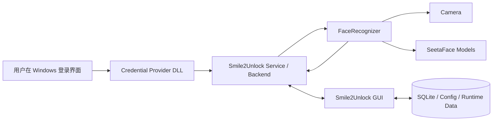
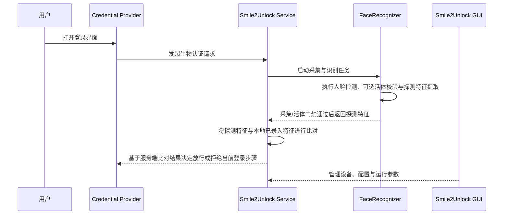
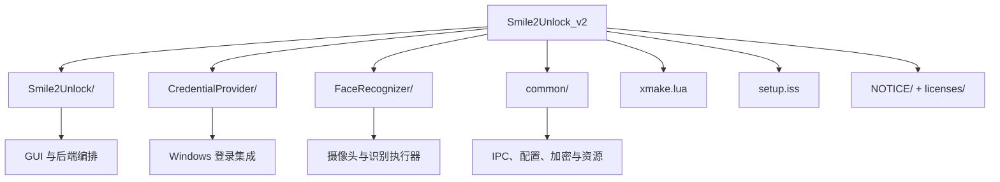
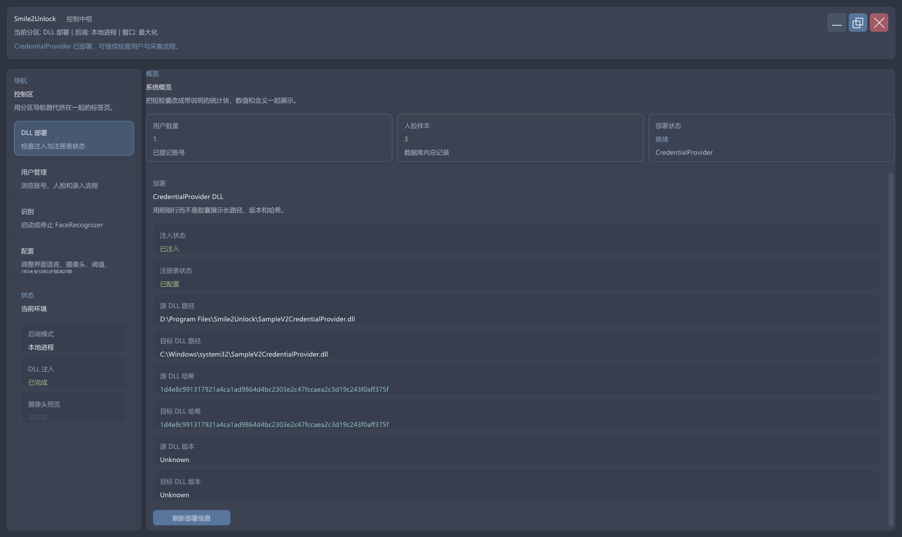
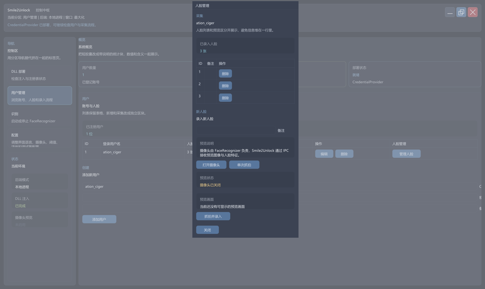
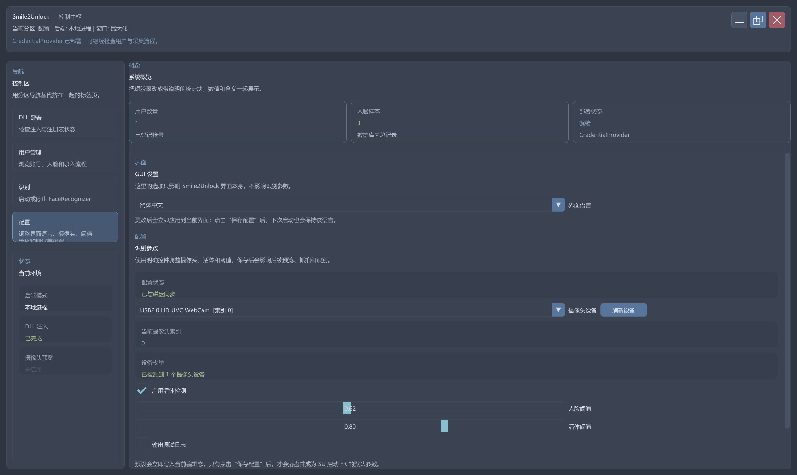
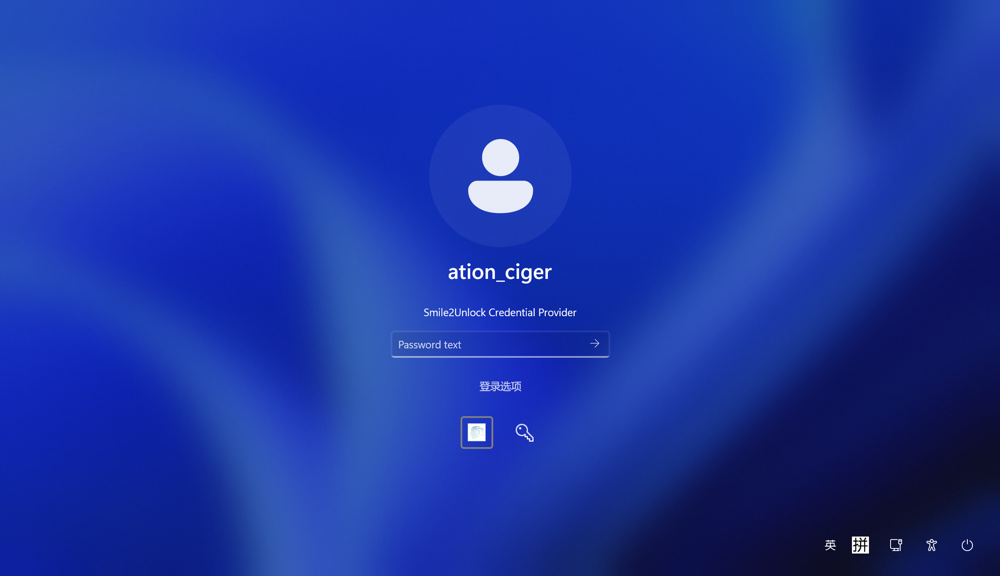
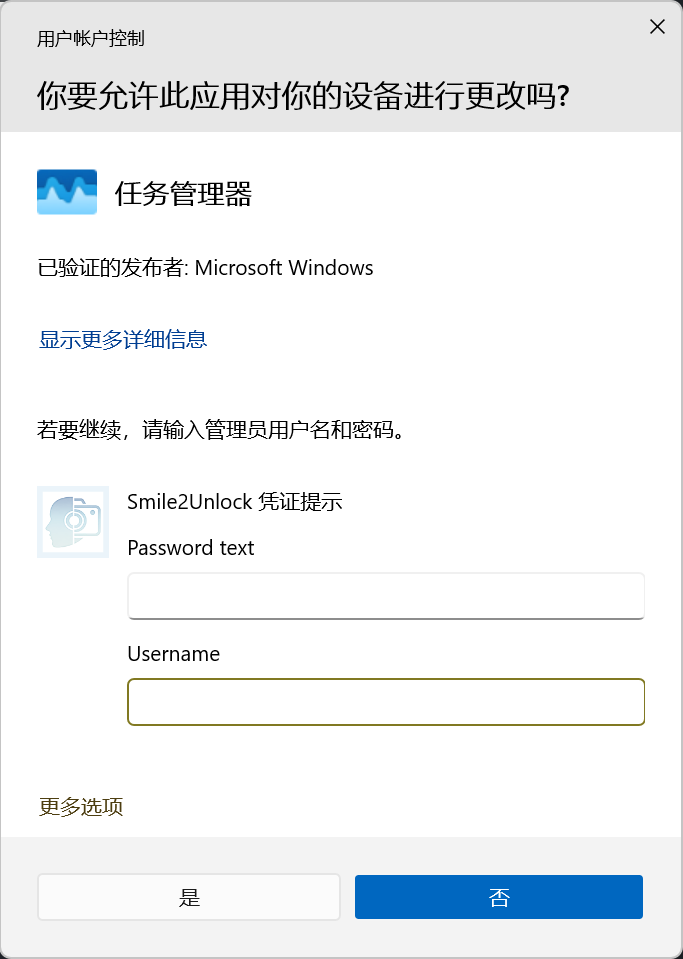

# Smile2Unlock

<p align="center">
  
</p>

<h3 align="center">一个基于 Windows Credential Provider、本地 IPC 与 SeetaFace 的现代化人脸解锁原型。</h3>

<p align="center">
  <a href="#项目简介">项目简介</a> •
  <a href="#安装与使用">安装与使用</a> •
  <a href="#系统架构">系统架构</a> •
  <a href="#从源代码构建">从源代码构建</a> •
  <a href="#截图展示">截图展示</a> •
  <a href="#安全说明">安全说明</a> •
  <a href="README.md">English</a>
</p>

<p align="center">
  
  
  
  
  
</p>

## 项目简介

Smile2Unlock 是一个面向 Windows 登录场景的人脸认证项目，核心目标是在 Windows Credential Provider 机制之上，构建一套可运行、可扩展的人脸解锁流程。

这个仓库不是单一程序，而是一套由多个组件协同组成的小系统：

- `Smile2Unlock`：主 GUI 与编排层
- `SampleV2CredentialProvider.dll`：接入 Windows 登录界面的 Credential Provider
- `FaceRecognizer`：负责摄像头采集、可选活体检测与特征提取
- `common`：共享模型、配置、加密、IPC、资源与语言文件

当前代码已经覆盖这些关键能力：

- 人脸采集与特征提取
- 基于 SeetaFace 的活体检测
- Windows 登录流程集成路径
- GUI / Service / Recognizer 之间的本地 IPC
- 安装器脚本与 Credential Provider 注册流程

## 安装与使用

对于大多数用户，最简单的方式是从 [Releases](https://github.com/Smile2Unlock/Smile2Unlock_v2/releases) 页面下载预构建的安装程序。

### 第一步：下载与安装
1. 访问 [Releases](https://github.com/Smile2Unlock/Smile2Unlock_v2/releases) 页面
2. 下载最新的 `Smile2Unlock-Setup.exe` 安装程序
3. 以管理员权限运行安装程序（注册 Credential Provider 需要管理员权限）
4. 按照安装向导完成安装

### 第二步：录入人脸
1. 安装完成后，从开始菜单或桌面快捷方式启动 **Smile2Unlock**
2. 进入 **Enrollment（录入）** 标签页
3. 点击 **"Add User"（添加用户）** 创建新用户账户
4. 点击 **"Capture Face"（采集人脸）** 录入面部特征
5. 你可以为不同的光照条件或角度录入多张人脸

### 第三步：使用人脸解锁
1. 锁定 Windows 会话（Win+L）或重启计算机
2. 在 Windows 登录界面，你应该能看到 Smile2Unlock 的凭证提供程序磁贴
3. 注视摄像头 - 系统将自动检测你的人脸并解锁
4. 如果人脸识别失败，你可以点击"登录选项"使用密码登录

### 故障排除
- **摄像头未检测到**：确保摄像头已正确连接且驱动程序已安装
- **人脸识别失败**：尝试在更好的光照条件下重新录入人脸
- **密码错误**：请使用用户密码而非PIN码登录。如果您使用微软账户，请尝试在Smile2Unlock注册时填写您的微软账户邮箱作为用户名
- **凭证提供程序未显示**：尝试重启计算机或以管理员权限重新运行安装程序

## 项目亮点

| 能力 | 说明 |
| --- | --- |
| 登录界面集成 | 通过自定义 Credential Provider 挂接到 Windows 登录流程 |
| 分进程架构 | GUI、后台服务、识别进程职责分离，更方便维护与调试 |
| 多种本地通信方式 | 使用共享内存与 UDP 传递图像、预览流、探测特征和状态 |
| 本地数据存储 | 结合 SQLite、配置文件与运行时目录保存本地状态 |
| 现代 C++ 构建链 | 基于 `xmake`、`clang`、`llvm-mingw` 与 C++26 modules |

## 系统架构



### 登录流程



### 运行时职责

- `SampleV2CredentialProvider.dll` 负责接入 Windows 身份验证界面。
- `Smile2Unlock.exe --service` 作为高权限后台服务与 IPC 主机运行。
- `Smile2Unlock.exe` 默认启动 GUI，并且在检测到已有服务进程时优先连接现有后端。
- `FaceRecognizer.exe` 负责摄像头相关识别任务，例如抓拍、预览流、活体检测和特征提取。登录流程中的特征比对与最终放行判断由 Service 持有。

<details>
<summary>为什么要拆成这几个部分</summary>

这样的拆分可以把 Windows 登录集成、界面逻辑、识别流程尽量解耦。这样既更利于调试登录流程，也更方便后续单独迭代识别器，而不需要把摄像头与模型逻辑直接塞进 Credential Provider DLL。

</details>

## 目录结构

```text
.
|-- Smile2Unlock/          # 主 GUI、后端服务、运行时编排
|-- CredentialProvider/    # Windows Credential Provider DLL
|-- FaceRecognizer/        # 识别进程、摄像头采集、SeetaFace 集成
|-- common/                # 共享模型、模块、IPC 工具、资源
|-- local-repo/            # 本地 xmake 包仓库
|-- licenses/              # 第三方许可证文本
|-- NOTICE/                # 第三方声明
|-- setup.iss              # Inno Setup 安装脚本
`-- xmake.lua              # 主构建入口
```

### 仓库模块图



## 技术栈

- Windows Credential Provider API
- SeetaFace 6
- SQLite3
- GLFW + Dear ImGui
- Boost
- Mbed TLS
- libyuv
- xmake
- clang + llvm-mingw

## 从源代码构建

*本节面向开发者或希望从源代码构建的用户。大多数用户应使用 [Releases](https://github.com/Smile2Unlock/Smile2Unlock_v2/releases) 页面提供的预构建安装程序。*

### 环境要求

- Windows 10 或更高版本
- `xmake`
- `llvm-mingw-ucrt-x86_64`
- 可用摄像头
- 安装和注册 Credential Provider 时需要管理员权限

### 构建

```powershell
xmake f -y -c -p mingw -a x86_64 --mingw="D:\Tools\llvm-mingw-ucrt-x86_64" --sdk="D:\Tools\llvm-mingw-ucrt-x86_64" --toolchain=clang --runtimes=c++_static
xmake require --build -f -y seetaface6open
xmake build
```

### 构建产物

[`xmake.lua`](xmake.lua) 中定义的主要目标包括：

- `Smile2Unlock`
- `FaceRecognizer`
- `SampleV2CredentialProvider.dll`

### 本地运行

启动 GUI：

```powershell
.\build\mingw\x86_64\release\Smile2Unlock.exe
```

启动后台服务模式：

```powershell
.\build\mingw\x86_64\release\Smile2Unlock.exe --service
```

查看识别器命令行帮助：

```powershell
.\build\mingw\x86_64\release\FaceRecognizer.exe --help
```

### 创建安装程序

仓库包含 Inno Setup 脚本 [`setup.iss`](setup.iss)，可用于创建可分发的安装程序。这对于希望打包自己构建版本的开发者非常有用：

- 使用上述说明构建项目
- 使用 Inno Setup 运行 `setup.iss` 来创建 `Smile2Unlock-Setup.exe`
- 生成的安装程序将：
  - 复制应用文件
  - 将 `SampleV2CredentialProvider.dll` 部署到 `System32`
  - 注册 Credential Provider 的 CLSID
  - 在管理员权限下完成安装

大多数用户应从 [Releases](https://github.com/Smile2Unlock/Smile2Unlock_v2/releases) 页面下载预构建的安装程序，而非自行构建。

## 截图展示

<p align="center">
  
</p>

<p align="center">
  
  
</p>

## 展示板块

这里先展示 Windows 登录相关效果：

<p align="center">
  
</p>

<p align="center">
  
</p>

## FaceRecognizer 命令行能力

`FaceRecognizer` 当前已经提供多个模式：

- `recognize`
- `capture-image`
- `preview-stream`
- `compare-features`

一个典型调用方式如下：

```powershell
.\FaceRecognizer.exe --mode recognize --camera 0 --liveness-detection=true
```

服务端启动识别进程时会显式传递布尔值，例如 `--liveness-detection=false`。在登录链路中，`recognize` 只会在采集与可选活体检测通过后输出探测特征；`Smile2Unlock.exe --service` 会把该特征与本地已录入特征比对，再向 Credential Provider 转发最终成功或失败状态。

## 当前状态

这个仓库更适合被理解为一个完成度较高的实验性原型，而不是已经可以直接投入生产环境的认证产品。

后续仍值得持续加强的方向包括：

- 部署与安装体验
- 日志、诊断与故障排查能力
- 摄像头、IPC、登录边界场景下的恢复能力
- 安全审计与威胁建模
- 认证敏感路径的测试覆盖

## 安全说明

本项目涉及 Windows 身份验证接口，并在本地处理生物特征相关数据。在研究、实验或受控环境之外使用之前，建议先进行充分的代码审查和安全验证。

如果要进一步走向生产可用，通常至少需要：

- 专门的安全评审
- Credential Provider 相关验证
- 活体检测效果评估
- 生物特征数据的安全存储与生命周期设计
- 登录集成失败时的回滚与恢复方案

## 许可证

本项目使用 [MIT License](LICENSE)。

第三方许可证与声明可见：

- [NOTICE/THIRD-PARTY-NOTICES.md](NOTICE/THIRD-PARTY-NOTICES.md)
- [`licenses/`](licenses)

## 贡献

欢迎围绕这些方向继续完善项目：

- 安装器打磨
- 识别稳定性增强
- 文档、图示与展示素材
- 测试与可复现环境建设

如果你引入新的第三方依赖，请同步更新许可证与归属声明。

## 贡献者

<p align="center">
  <a href="https://github.com/aurorae114514">
    
  </a>
  <a href="https://github.com/dullspear">
    
  </a>
  <a href="https://space.bilibili.com/1258455455">
    
  </a>
</p>

<p align="center">
  <a href="https://github.com/aurorae114514"><strong>ation_ciger</strong></a> •
  <a href="https://github.com/dullspear"><strong>dullspear</strong></a> •
  <a href="https://space.bilibili.com/1258455455"><strong>YAUE</strong></a>
</p>

<p align="center">
  <a href="https://github.com/Smile2Unlock/Smile2Unlock_v2/graphs/contributors">
    
  </a>
</p>
