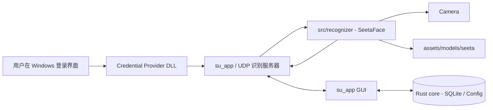
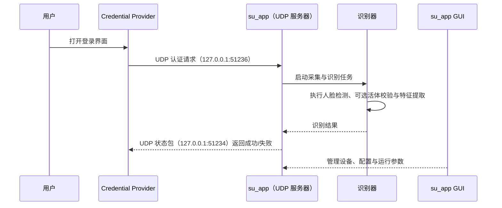
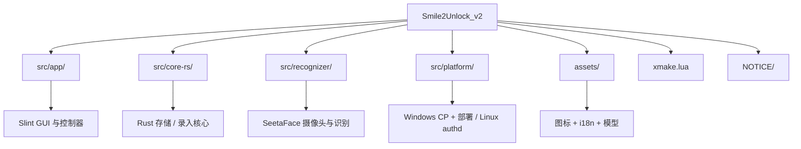
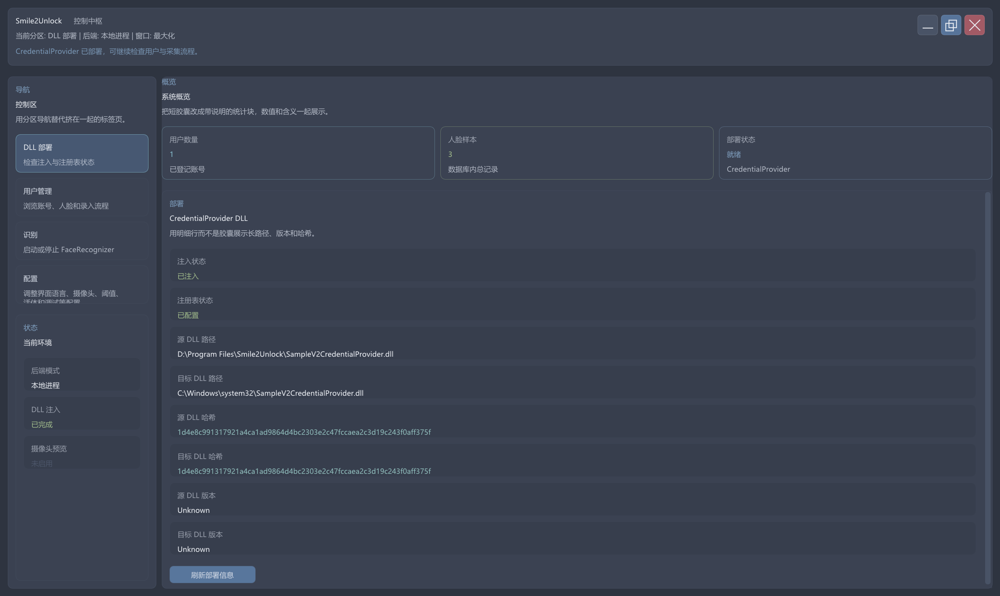
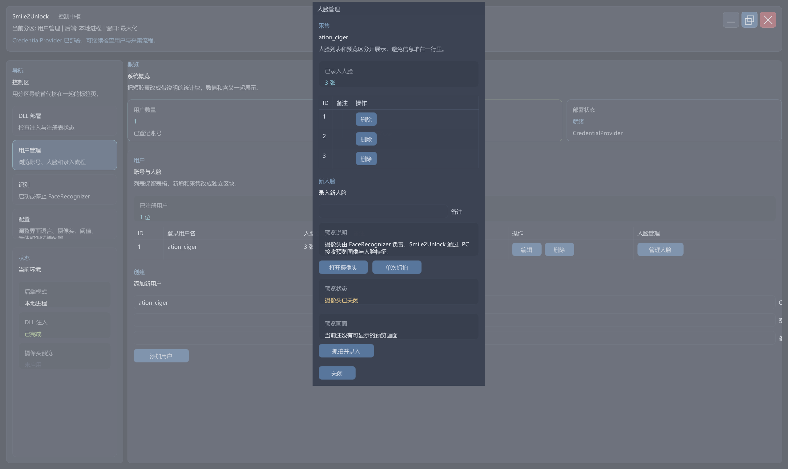
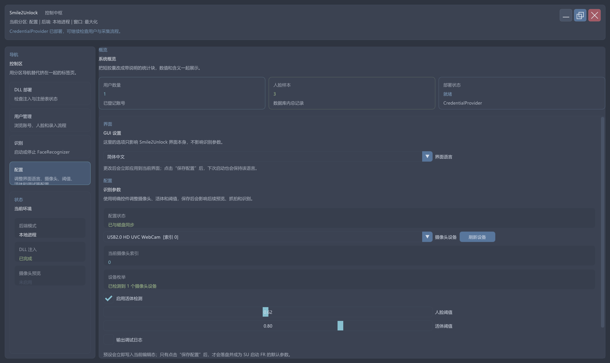
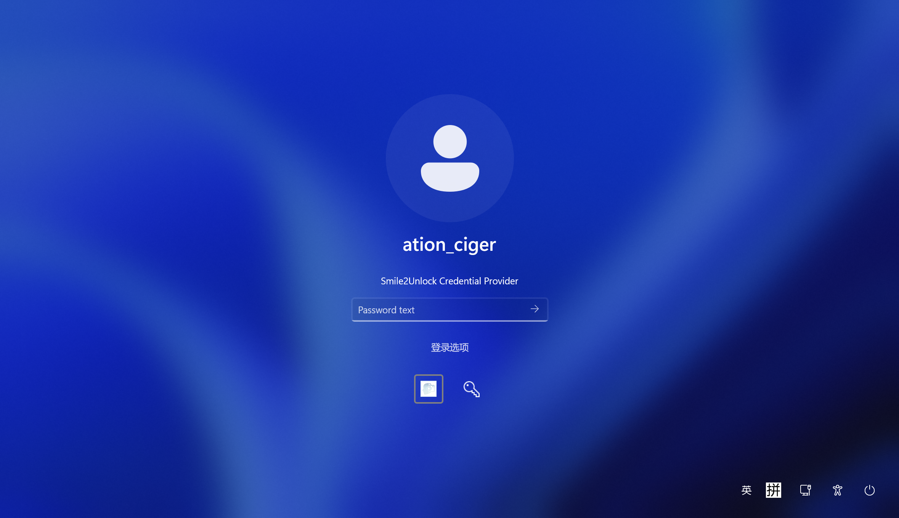
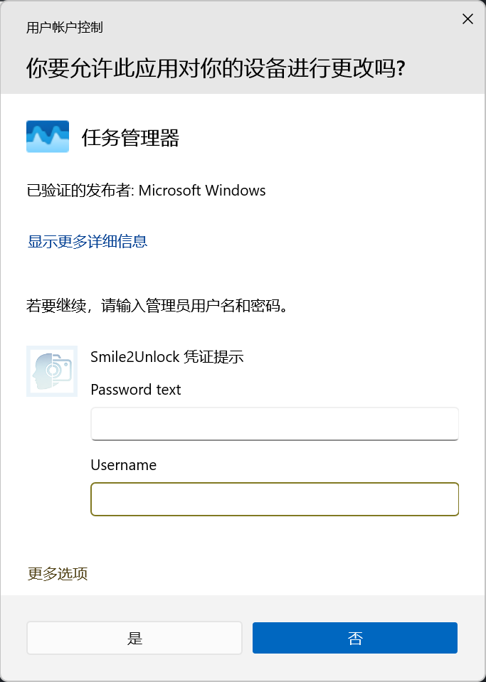

# Smile2Unlock

<p align="center">
  
</p>

<h3 align="center">一个基于 Windows Credential Provider、本地 IPC 与 SeetaFace 的现代化人脸解锁原型。</h3>

<p align="center">
  <a href="#项目简介">项目简介</a> •
  <a href="#安装与使用">安装与使用</a> •
  <a href="#系统架构">系统架构</a> •
  <a href="#从源代码构建">从源代码构建</a> •
  <a href="#截图展示">截图展示</a> •
  <a href="#安全说明">安全说明</a> •
  <a href="README.md">English</a>
</p>

<p align="center">
  
  
  
  
  
</p>

## 项目简介

Smile2Unlock 是一个面向 Windows 登录场景的人脸认证项目，核心目标是在 Windows Credential Provider 机制之上，构建一套可运行、可扩展的人脸解锁流程。

这个仓库不是单一程序，而是一套由多个组件协同组成的小系统：

- `su_app`：Slint 桌面 GUI 与编排层
- `su_authd`（Linux）/ Credential Provider（Windows）：登录集成
- `su_deploy_helper`：特权部署助手（Windows 走 UAC，Linux 走 D-Bus/Polkit）
- `src/recognizer`：摄像头采集、活体检测与 SeetaFace 特征提取
- `assets/`：仓库唯一的资源目录（图标、i18n、SeetaFace 模型）

当前代码已经覆盖这些关键能力：

- 人脸采集与特征提取
- 基于 SeetaFace 的活体检测
- Windows 登录流程集成路径
- 登录流程使用的 UDP 识别服务器，以及 GUI 组件间的本地 IPC
- 应用内部署（Credential Provider 注册、服务管理）与 UAC 提权

## 安装与使用

### 第一步：部署应用

将构建产物（`su_app.exe`、`su_deploy_helper.exe` 以及旁边的 `assets/` 目录）复制到目标机器的某个目录，例如 `C:\su-deploy\bin\`。

### 第二步：录入人脸
1. 从部署目录启动 **Smile2Unlock**（`su_app.exe`）
2. 进入 **Enrollment（录入）** 标签页
3. 点击 **"Add User"（添加用户）** 创建新用户账户
4. 点击 **"Capture Face"（采集人脸）** 录入面部特征
5. 你可以为不同的光照条件或角度录入多张人脸

### 第三步：启用人脸解锁
1. 在应用内打开 **Deployment（部署）** 面板并点击 **Install（安装）**（会弹出 UAC 提权提示——部署助手将完成 Credential Provider 注册与服务安装）
2. 锁定 Windows 会话（Win+L）或重启计算机
3. 在 Windows 登录界面，你应该能看到 Smile2Unlock 的凭证提供程序磁贴
4. 注视摄像头 - 系统将自动检测你的人脸并解锁
5. 如果人脸识别失败，你可以点击"登录选项"使用密码登录

### 故障排除
- **摄像头未检测到**：确保摄像头已正确连接且驱动程序已安装
- **人脸识别失败**：尝试在更好的光照条件下重新录入人脸
- **密码错误**：请使用用户密码而非PIN码登录。如果您使用微软账户，请尝试在Smile2Unlock注册时填写您的微软账户邮箱作为用户名
- **凭证提供程序未显示**：尝试重启计算机或以管理员权限重新运行安装程序

## 项目亮点

| 能力 | 说明 |
| --- | --- |
| 登录界面集成 | 通过自定义 Credential Provider 挂接到 Windows 登录流程 |
| 分进程架构 | GUI、特权部署助手、识别进程职责分离，更方便维护与调试 |
| UDP + socket IPC | 登录流程走 UDP 识别服务器，GUI 间通过控制 socket 通信 |
| 本地数据存储 | Rust core 结合 SQLite 提供明文/加密存储 |
| 现代构建链 | 基于 `xmake`、`g++`（mingw / 原生）、C++26 modules、Rust、Zig 与 Slint |

## 系统架构


```mermaid
flowchart LR
    U[用户在 Windows 登录界面] --> CP[Credential Provider DLL]
    CP --> S[su_app / UDP 识别服务器]
    S --> R[src/recognizer - SeetaFace]
    S <--> GUI[su_app GUI]
    GUI <--> CORE[(Rust core - SQLite / Config)]
    R --> CAM[Camera]
    R --> MODEL[assets/models/seeta]
    R --> S
```

### 登录流程


```mermaid
sequenceDiagram
    participant User as 用户
    participant CP as Credential Provider
    participant S as su_app（UDP 服务器）
    participant R as 识别器
    participant GUI as su_app GUI

    User->>CP: 打开登录界面
    CP->>S: UDP 认证请求（127.0.0.1:51236）
    S->>R: 启动采集与识别任务
    R->>R: 执行人脸检测、可选活体校验与特征提取
    R-->>S: 识别结果
    S-->>CP: UDP 状态包（127.0.0.1:51234）返回成功/失败
    GUI-->>S: 管理设备、配置与运行参数
```

### 运行时职责

- `su_deploy_helper.exe`（Windows，UAC）/ `su_deploy_helper`（Linux，D-Bus/Polkit）负责特权部署：Credential Provider 注册、服务安装。
- `su_app` 承载 GUI、人脸档案管理（通过 Rust core 录入/列出/删除）、UDP 识别服务器与部署面板。

<details>
<summary>为什么要拆成这几个部分</summary>

这样的拆分可以把 Windows 登录集成、界面逻辑、识别流程尽量解耦。这样既更利于调试登录流程，也更方便后续单独迭代识别器，而不需要把摄像头与模型逻辑直接塞进 Credential Provider DLL。

</details>

## 目录结构

```text
.
|-- src/                   # 全部源代码
|   |-- app/               # su_app GUI 入口与控制器（分平台）
|   |-- modules/           # C++26 modules（su.core.types、su.app.*、su.recognizer.*）
|   |-- core-rs/           # Rust core（存储、录入、加密）
|   |-- recognizer/        # SeetaFace 后端、摄像头、图像流水线
|   |-- platform/          # Windows（CP、UDP 服务器、部署）/ Linux（authd、部署）
|   `-- zig/               # Zig 组件
|-- assets/                # 唯一资源目录：icons/、i18n/、models/seeta/
|-- docs/                  # 设计文档
|-- packaging/             # Linux 打包（package.sh、systemd、dbus、polkit）
|-- local-repo/            # 本地 xmake 包仓库
|-- NOTICE/                # 第三方声明
`-- xmake.lua              # 主构建入口
```

### 仓库模块图


```mermaid
flowchart TD
    ROOT[Smile2Unlock_v2]
    ROOT --> APP[src/app/]
    ROOT --> CORE[src/core-rs/]
    ROOT --> REC[src/recognizer/]
    ROOT --> PLAT[src/platform/]
    ROOT --> ASSETS[assets/]
    ROOT --> BUILD[xmake.lua]
    ROOT --> NOTICE[NOTICE/]

    APP --> APP1[Slint GUI 与控制器]
    CORE --> CORE1[Rust 存储 / 录入核心]
    REC --> REC1[SeetaFace 摄像头与识别]
    PLAT --> PLAT1[Windows CP + 部署 / Linux authd]
    ASSETS --> ASSETS1[图标 + i18n + 模型]
```

## 技术栈

- Windows Credential Provider API
- Slint（UI）
- SeetaFace 6
- SQLite3
- C++26 modules
- Rust（核心存储 / 录入、Credential Provider 助手）
- Zig（平台组件）
- libyuv
- xmake
- g++（Windows 用 mingw，Linux 用原生）

## 从源代码构建

*本节面向开发者或希望从源代码构建的用户。*

### 环境要求

- Windows 10 或更高版本
- `xmake`
- MinGW-w64 工具链（支持 C++26 modules 的 `g++`，如 mingw-w64-gcc 14+）
- 可用摄像头
- 安装和注册 Credential Provider 时需要管理员权限

### 构建

```powershell
xmake f -y -c -p mingw -a x86_64
xmake require --build -f -y seetaface6open
xmake build
```

Windows Credential Provider（`su_credential_provider.dll`）由 Rust 构建：

```powershell
cargo build --release --target x86_64-pc-windows-gnu --manifest-path src\platform\windows\credential_provider_rs\Cargo.toml
```

### 构建产物

[`xmake.lua`](xmake.lua) 中定义的主要目标包括：

- `su_app`（Windows 下为 `su_app.exe`）—— Slint GUI
- `su_deploy_helper`（Windows 下为 `su_deploy_helper.exe`）—— 特权部署助手
- `su_authd`（仅 Linux）—— 认证守护进程
- `su_credential_provider.dll`（仅 Windows，Rust）—— Credential Provider

### 本地运行

启动 GUI（Windows）：

```powershell
.\build\mingw\x86_64\release\su_app.exe
```

### 创建安装程序

Linux 下运行 [`packaging/linux/package.sh`](packaging/linux/package.sh) 可生成 `tar.gz` / `pacman` / `deb` / `rpm` 包：

```bash
packaging/linux/package.sh --format all
```

生成的包包含 `su_app`、`su_authd`、`su_deploy_helper`、PAM 模块，以及从 `assets/` 暂存到 `/usr/share/smile2unlock/` 的资源（i18n 与 SeetaFace 模型）。

大多数用户应使用打包发布的版本，而非自行构建。

## 截图展示

<p align="center">
  
</p>

<p align="center">
  
  
</p>

## 展示板块

这里先展示 Windows 登录相关效果：

<p align="center">
  
</p>

<p align="center">
  
</p>

## 登录链路说明

在 Windows 登录链路中，Credential Provider 通过 UDP 向 `su_app` 发送认证请求（端口 51236）。`su_app` 通过 SeetaFace 后端完成人脸采集、可选活体检测与特征提取，将探测特征与本地已录入特征比对，并通过状态通道（端口 51234）把结果回传给 Credential Provider。

## 当前状态

这个仓库更适合被理解为一个完成度较高的实验性原型，而不是已经可以直接投入生产环境的认证产品。

后续仍值得持续加强的方向包括：

- 部署与安装体验
- 日志、诊断与故障排查能力
- 摄像头、IPC、登录边界场景下的恢复能力
- 安全审计与威胁建模
- 认证敏感路径的测试覆盖

## 安全说明

本项目涉及 Windows 身份验证接口，并在本地处理生物特征相关数据。在研究、实验或受控环境之外使用之前，建议先进行充分的代码审查和安全验证。

如果要进一步走向生产可用，通常至少需要：

- 专门的安全评审
- Credential Provider 相关验证
- 活体检测效果评估
- 生物特征数据的安全存储与生命周期设计
- 登录集成失败时的回滚与恢复方案

## 许可证

本项目使用 [MIT License](LICENSE)。

第三方许可证与声明可见：

- [NOTICE/THIRD-PARTY-NOTICES.md](NOTICE/THIRD-PARTY-NOTICES.md)
- [`licenses/`](licenses)

## 贡献

欢迎围绕这些方向继续完善项目：

- 安装器打磨
- 识别稳定性增强
- 文档、图示与展示素材
- 测试与可复现环境建设

如果你引入新的第三方依赖，请同步更新许可证与归属声明。

## 贡献者

<p align="center">
  <a href="https://github.com/aurorae114514">
    
  </a>
  <a href="https://github.com/dullspear">
    
  </a>
  <a href="https://space.bilibili.com/1258455455">
    
  </a>
</p>

<p align="center">
  <a href="https://github.com/aurorae114514"><strong>ation_ciger</strong></a> •
  <a href="https://github.com/dullspear"><strong>dullspear</strong></a> •
  <a href="https://space.bilibili.com/1258455455"><strong>YAUE</strong></a>
</p>

<p align="center">
  <a href="https://github.com/Smile2Unlock/Smile2Unlock_v2/graphs/contributors">
    
  </a>
</p>
