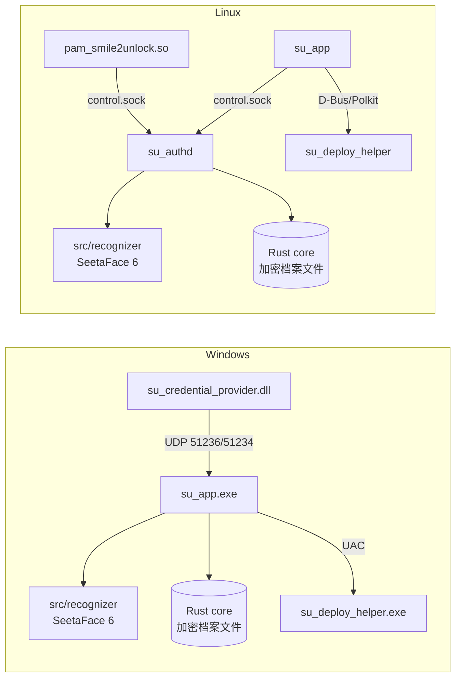

# Smile2Unlock

<p align="center">
  
</p>

<h3 align="center">本地人脸认证系统 · Windows 登录集成 + Linux PAM 认证</h3>

<p align="center">
  <a href="#项目简介">项目简介</a> •
  <a href="#平台">平台</a> •
  <a href="#部署">部署</a> •
  <a href="#架构">架构</a> •
  <a href="#仓库结构">仓库结构</a> •
  <a href="#构建">构建</a> •
  <a href="#贡献者">贡献者</a> •
  <a href="README.md">English</a>
</p>

<p align="center">
  
  
  
  
  
</p>

## 项目简介

Smile2Unlock 是一套**本地人脸认证系统**:人脸特征全部在本机提取与比对(SeetaFace 6),不依赖任何云服务。它由两个平台变体组成:

- **Windows**:通过 Credential Provider 集成到 Winlogon 登录界面(锁定屏幕、UAC 提权界面)
- **Linux**:通过 PAM 模块接入 `login` / GDM / SDDM 等认证流程

两个平台共享同一套核心:C++26 modules 编写的识别流水线、Rust 编写的人脸档案存储(明文与加密两种后端)、Slint 编写的 GUI,以及 xmake 构建系统。

## 平台

### Windows

| 组件 | 形态 | 职责 |
| --- | --- | --- |
| `su_app.exe` | Slint GUI | 人脸档案管理(录入/删除)、UDP 识别服务器、部署面板 |
| `su_credential_provider.dll` | Rust CP | Winlogon 登录界面集成,通过 UDP 向 `su_app` 发起认证 |
| `su_deploy_helper.exe` | UAC 提权助手 | Credential Provider 注册/注销、认证服务安装,由 GUI 面板触发 |

登录流程:锁定屏幕 → CP 磁贴 → UDP 认证请求(127.0.0.1:51236)→ `su_app` 本地识别 → 状态回包(127.0.0.1:51234)→ 放行或拒绝。全程不出本机。

### Linux

| 组件 | 形态 | 职责 |
| --- | --- | --- |
| `su_app` | Slint GUI | 人脸档案管理、识别预览,通过控制 socket 与守护进程通信 |
| `su_authd` | systemd 服务 | 认证守护进程,持有控制 socket(`/run/smile2unlock/control.sock`),执行识别与比对 |
| `pam_smile2unlock.so` | PAM 模块 | 登录时向 `su_authd` 发起认证请求 |
| `su_deploy_helper` | D-Bus + Polkit | 服务安装、PAM 配置等特权操作,由 GUI 面板触发 |

登录流程:登录界面 → PAM 认证钩子 → 控制 socket → `su_authd` 本地识别 → 认证结果返回 PAM。凭证存储密钥由 systemd 托管;同样全程不出本机。

## 部署

Windows 采用 **`bin\` + `assets\` 平级布局**:可执行文件(及其运行 DLL)放在 `bin\` 中,`assets\` 与它同级。Linux 按系统安装的 FHS 布局分散放置。

```text
Windows:  C:\su-deploy\
├── bin\                     # 可执行文件 + 运行 DLL
│   ├── su_app.exe
│   ├── su_deploy_helper.exe
│   ├── su_credential_provider.dll
│   ├── Smile2UnlockAuthService.exe
│   ├── Smile2Unlock.ico
│   └── (SeetaFace / tennis / MinGW 运行库)
└── assets\
    ├── i18n\
    │   ├── en.json
    │   └── zh-CN.json
    └── models\
        └── seeta\
            ├── face_detector.csta
            ├── face_landmarker_pts5.csta
            ├── face_recognizer.csta
            ├── fas_first.csta
            └── fas_second.csta

Linux(打包后):  /usr/bin/su_app
               /usr/libexec/smile2unlock/{su_authd,su_deploy_helper}
               /usr/lib/security/pam_smile2unlock.so
               /usr/share/smile2unlock/{i18n,models}
```

- 模型目录按 `SU_SEETAFACE_MODEL_DIR` 环境变量、编译期宏、「从当前目录向上查找 `assets/models/seeta`」的顺序解析;i18n 用同样的向上查找定位 `assets/i18n`(这正是 `bin\` + `assets\` 平级布局能工作的原因);Linux 系统安装后回退到 `/usr/share/smile2unlock/models`
- Windows 复制文件后,在 GUI 的 **Deployment(部署)** 面板点击 Install(UAC 提权),即可完成 CP 注册与服务安装

## 架构


```mermaid
flowchart LR
    subgraph Windows
        CP[su_credential_provider.dll] -- UDP 51236/51234 --> APP[su_app.exe]
        APP --> REC[src/recognizer<br/>SeetaFace 6]
        APP --> CORE[(Rust core<br/>加密档案文件)]
        APP -- UAC --> HELPER[su_deploy_helper.exe]
    end
    subgraph Linux
        PAM[pam_smile2unlock.so] -- control.sock --> AUTHD[su_authd]
        AUTHD --> REC2[src/recognizer<br/>SeetaFace 6]
        AUTHD --> CORE2[(Rust core<br/>加密档案文件)]
        GUI[su_app] -- control.sock --> AUTHD
        GUI -- D-Bus/Polkit --> HELPER2[su_deploy_helper]
    end
```

### 运行时角色

- **识别流水线**(`src/recognizer`):摄像头采集(V4L2 / Windows Media Foundation)、SeetaFace 检测 / 关键点 / 特征提取 / 活体检测,全部本地执行
- **Rust core**(`src/core-rs`):人脸档案的明文与加密存储(Windows 无主密钥提供者时用明文,Linux 密钥由 systemd 托管)
- **GUI**(`src/app`):Slint 界面 + 平台控制器;Windows 内置 UDP 识别服务器,Linux 通过控制 socket 与 `su_authd` 交互

### 本地存储(两个平台一致)

**不使用 SQLite**:两个平台共用同一套 Rust core 存储——原子写入的私有文件:

| 数据 | 格式 | Linux | Windows |
| --- | --- | --- | --- |
| 应用配置 | TOML | `~/.config/smile2unlock/config.toml` | `%APPDATA%\smile2unlock\config.toml` |
| UI 偏好 | JSON | `~/.config/smile2unlock/ui.json` | `<exe 目录>\.smile2unlock-ui.json` |
| 人脸档案 | XChaCha20-Poly1305 封套内的 JSON | `/var/lib/smile2unlock/users/<uid>/profiles.s2u` | `%PROGRAMDATA%\smile2unlock\users\<sid>\profiles.s2u` |

平台差异仅在于目录惯例(XDG vs `%APPDATA%`、`/var/lib` vs `%PROGRAMDATA%`);文件格式与 Rust core 代码路径完全相同。Linux 写入为 `0600` + fsync,Windows 用 `MoveFileExW` 原子替换。

两个平台的秘密数据都用 `zeroize` 清零。Linux `su_authd` 的主密钥放在页对齐的 `mmap` 中:`mlock` 锁页、标记 `MADV_DONTDUMP`、空闲时用 `mprotect(PROT_NONE)` 封存——与 Windows Credential Provider 使用的 vendored `memsafe` fork 提供的空闲封存(锁定 + `PAGE_NOACCESS`)同一语义;LogonUI 内密码/密钥另有锁定 + `PAGE_NOACCESS` 保护。密钥读取是限定在消费调用内(`with_bytes` / `with_context`)的临时 `PROT_READ` 提升。

## 仓库结构

```text
.
|-- src/
|   |-- app/                  # su_app GUI 入口 + 平台控制器
|   |-- modules/              # C++26 modules(su.core.* / su.app.* / su.recognizer.*)
|   |-- core-rs/              # Rust 档案存储与加密
|   |-- recognizer/           # SeetaFace 后端、摄像头、图像流水线
|   |-- platform/
|   |   |-- windows/          # Rust CP、UDP 服务器、部署助手、认证服务
|   |   `-- linux/            # authd、PAM、部署助手
|   `-- zig/                  # Zig 组件
|-- assets/                   # 唯一资源目录:icons / i18n / models/seeta
|-- packaging/                # Linux 打包(package.sh、systemd、dbus、polkit)
|-- docs/                     # 设计文档
|-- local-repo/               # 本地 xmake 包仓库
|-- NOTICE/                   # 第三方声明
`-- xmake.lua                 # 构建入口
```

## 构建

### Windows(交叉编译或原生)

```bash
xmake f -y -c -p mingw -a x86_64
xmake require --build -f -y seetaface6open
xmake build
```

Windows Credential Provider 由 Rust 构建:

```bash
cargo build --release --target x86_64-pc-windows-gnu \
    --manifest-path src/platform/windows/credential_provider_rs/Cargo.toml
```

产物:`build/mingw/x86_64/release/su_app.exe`、`su_deploy_helper.exe` 及同目录 `assets/`。

### Linux

```bash
xmake f -y -p linux
xmake require --build -f -y seetaface6open
xmake build
```

打包(`tar.gz` / `pacman` / `deb` / `rpm`):

```bash
packaging/linux/package.sh --format all
```

## 贡献者

**代码贡献**

- [ation_ciger](https://github.com/aurorae114514)
- [dullspear](https://github.com/dullspear)

**Logo 设计**

- [YAUE](https://space.bilibili.com/1258455455)

## 安全说明

本项目涉及 Windows/Linux 认证表面与本地面部生物特征数据。请在使用前仔细审查代码;生产部署需要专门的安全评审、防欺骗评估与生物特征数据的生命周期管理。

## 许可证

[MIT License](LICENSE)

第三方归属与声明见 [NOTICE/THIRD-PARTY-NOTICES.md](NOTICE/THIRD-PARTY-NOTICES.md)。
