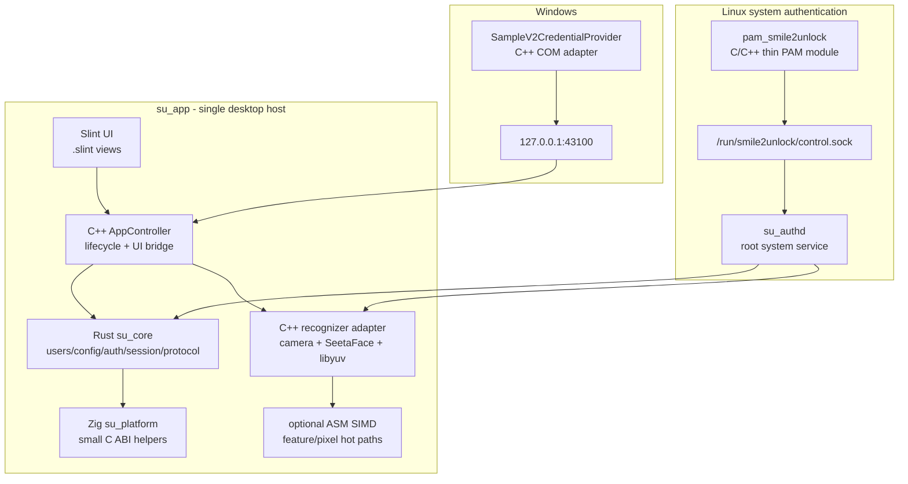

# Smile2Unlock Polyglot Slint Rewrite Master Plan

## Summary

本次重写目标是把 Smile2Unlock 从当前偏 Windows、IPC 分散、GUI 依赖不稳定的实现，重构为一套以 `Slint + C++26 + Rust + Zig + xmake + g++` 为基础的单宿主优先架构。

## Current Status (2026-07-18)

Phase 0, 1, 2 — **全部完成**。Phase 3 — **实现完成、部署验证待完成**（Rust control protocol、root `su_authd`、Unix control socket、PAM client、systemd unit 均已实现并通过构建/自动测试；尚未修改本机 PAM 栈并重启验证真实开机登录）。Phase 4, 5 — 未开始。

已构建 10 个 xmake target，全部通过 `xmake build` + `xmake test`（Rust 33 个单元测试 + 3 个 C++ smoke test 均通过）。

重写后的第一阶段目标：

- Linux 成为一等平台，完整覆盖桌面 GUI、摄像头识别、用户管理、配置、PAM 认证链路。
- Windows 保留 Credential Provider 路径，但作为平台适配层维护，不再牵引整体架构。
- GUI 从 EUI 切换到 Slint，避免 EUI 频繁 breaking change 影响重写节奏。
- 桌面功能采用单进程宿主 `su_app`；为支持用户会话建立前的开机登录，Linux 认证链路由最小系统服务 `su_authd` 承接。
- 外部 IPC 第一阶段只保留 PAM / Windows Credential Provider 到平台认证宿主的 control socket。
- 核心 C++ 代码继续使用 C++26，并保持函数式编程风格。
- C++ 主工具链优先使用 g++，clang 可作为辅助验证工具链，但不作为第一阶段主线。
- Rust 用于安全敏感、数据模型、配置、协议解析、认证策略等核心逻辑。
- Zig 用于低层平台 helper、C ABI glue、跨编译友好的小型系统工具。
- 汇编只作为可选 SIMD 优化层，不进入业务逻辑。

## Non-goals

第一阶段不做这些事情：

- 不把所有模块都改成 Rust 或 Zig。
- 不实现承载 GUI、配置管理或通用业务的独立 backend daemon；`su_authd` 仅作为开机登录所需的系统认证边界。
- 不把人脸识别进程化为默认路径。
- 不引入远程认证服务。
- 不把汇编作为必须依赖。
- 不继续维护 EUI 作为主 GUI。
- 不把 OpenCV 作为默认图像处理依赖。

## Architecture

推荐方案名称：

```text
B+ Slint Polyglot Single-Host Architecture
```

总体调用模型：

```text
Slint UI
  -> C++ AppController
  -> Rust su_core
  -> C++ recognizer adapter
  -> SeetaFace / libyuv / camera
```

外部认证调用模型：

```text
Linux PAM
  -> control socket
  -> su_authd
  -> Rust su_core auth policy
  -> C++ recognizer adapter

Windows Credential Provider
  -> control socket
  -> su_app Windows runtime
```

架构图：



## Language Strategy

### C++

C++ 是 integration language，负责：

- `su_app` 主进程入口、生命周期、线程边界。
- Slint C++ 宿主和 UI 回调桥接。
- SeetaFace、libyuv、摄像头 API 的集成。
- PAM thin module。
- Windows Credential Provider / COM / Win32 适配。
- 与 Rust、Zig、汇编之间的 C ABI 或 cxxbridge 边界。

C++ 标准：

- 新代码使用 C++26。
- 可以使用 C++ Modules，但不强制所有代码模块化。
- 平台适配、第三方 C/C++ 边界、PAM/CP、SeetaFace wrapper 可以继续使用 `.h/.cpp`。

工具链：

- Linux 主工具链优先使用 g++。
- clang 可用于 CI 兼容性检查，但不要求作为默认开发工具链。
- xmake 配置应支持显式选择 `gcc` / `clang`，默认不锁死 clang。

### Rust

Rust 是 core language，负责：

- 用户、配置、认证策略、会话状态。
- 协议帧安全解析和校验。
- 配置模型、迁移、默认值、字段兼容。
- 数据库存储逻辑。
- fuzz / property tests / 安全边界测试。

Rust 建议库：

- `serde`
- `serde_json`
- `toml`
- `thiserror`
- `tracing`
- `rusqlite`
- `zeroize`

Rust 和 C++ 的边界：

- 优先使用 C ABI 或 `cxxbridge`。
- FFI 边界不得暴露 Rust 内部泛型、trait object、生命周期类型。
- FFI 返回值使用显式 status code + out parameter，或稳定 Result-like C ABI 类型。
- Rust 内部可以使用 `Result<T, E>` 和类型化错误；跨语言边界必须转换为稳定错误码。

### Zig

Zig 是 low-level helper language，负责：

- 小型平台 helper。
- C ABI glue。
- 原子文件写入、路径处理、权限处理等可独立测试的系统辅助逻辑。
- 未来跨平台小工具和安装辅助工具。

Zig 不负责：

- GUI。
- 认证策略。
- 数据模型主逻辑。
- SeetaFace 核心 wrapper。

Zig 边界规则：

- 只导出 C ABI。
- 不让 C++ 直接依赖 Zig 内部类型。
- Zig target 独立构建成 static library 或小型 tool。

### Assembly

汇编只允许用于可选优化：

- 特征向量距离计算。
- 图像像素格式转换 micro-kernel。
- 明确证明有性能收益的短热路径。

约束：

- 必须有 C++ 或 Rust scalar fallback。
- 必须进行 runtime CPU feature detection。
- 默认构建不能依赖汇编存在。
- 汇编函数只暴露 C ABI。

## Functional Core Requirements

核心逻辑必须保持函数式编程风格，但不做不必要的抽象。

要求：

- 先分离纯计算和副作用。
- 业务规则优先写成显式输入、显式输出的纯函数。
- 配置校验、认证策略、协议解析、状态迁移优先使用不可变输入和返回新值。
- 使用 `std::optional` 表示可缺失值。
- 使用 `std::expected` 或 Rust `Result` 表示带原因的失败。
- 使用 `std::variant` / Rust enum 表示互斥状态，避免多个 bool flag 组合非法状态。
- 集合转换优先考虑算法、ranges、iterator pipeline，但以可读性为准。
- lambda 可用于局部组合和回调，不把大块业务逻辑塞进匿名 lambda。
- `std::function` 只用于确实需要类型擦除的接口，不作为默认组合工具。
- 热路径允许受控 mutation，例如图像 buffer、特征向量、FFI out parameter，但必须封装在边界内。

不要求：

- 不要求所有循环都替换成算法。
- 不要求所有对象都不可变。
- 不要求所有异步流程都使用 coroutine。
- 不要求为了函数式风格引入难调试的模板 DSL。

## Target Plan

第一阶段 target：

- `su_app`
  - C++ binary。
  - Slint GUI 宿主。
  - 管理生命周期、UI bridge、control socket、recognizer adapter。

- `su_core`
  - Rust static library 或 cdylib。
  - 承载 users/config/auth/session/protocol/storage。
  - 第一阶段建议 static library。

- `su_recognizer`
  - C++ static library。
  - 承载 camera、SeetaFace wrapper、libyuv 转换、预览帧捕获、特征提取。
  - 不是独立进程。

- `su_platform_zig`
  - Zig static library。
  - 小型平台 helper。
  - 可选 target，第一阶段允许为空实现或最小实现。

- `pam_smile2unlock`
  - Linux PAM `.so`。
  - C/C++ thin shim。
  - 只负责 PAM 生命周期和 control socket，不承载认证策略。

- `su_authd`
  - Linux root system service。
  - 在 display manager 前启动，拥有 Unix control socket，并按 PAM 用户调用 Rust auth policy 与 recognizer。
  - 只处理 `status` / `authenticate` / `cancel`，不承载 GUI 或用户管理。

- `SampleV2CredentialProvider`
  - Windows-only C++ target。
  - 只负责 Windows 登录入口和 control socket。

第二阶段可选 target：

- `su_protocol_fuzz`
  - Rust fuzz / property test。

- `su_bench`
  - C++ / Rust benchmark。

- `su_simd`
  - 可选汇编 object 或 static library。

- `su_facerecognizer`
  - 仅当需要崩溃隔离或权限隔离时再恢复为独立进程。
  - 其协议必须隐藏在 `su_recognizer` adapter 后面，不能影响 UI 和 core API。

## Dependency Plan

### Keep

- `slint`
  - 主 GUI 框架。
  - 必须 pin 版本。
  - 推荐放入 `local-repo`，不跟随滚动 latest。

- `seetaface6open`
  - 人脸检测、关键点、特征提取、活体检测。
  - 继续使用本地包或受控本地安装。

- `libyuv`
  - 摄像头帧格式转换。

- `sqlite3`
  - 如果 Rust 侧使用 `rusqlite`，由 Rust 依赖链管理。
  - 如果 C++ 侧直接访问数据库，则显式 xmake 依赖。
  - 第一阶段建议数据库归 Rust `su_core` 管理。

### Replace

- `EUI` -> `Slint`
  - EUI breaking change 风险过高。

### Remove or Defer

- `glad`
  - Slint 接管 GUI 渲染路径，第一阶段不手写 OpenGL。

- `glfw`
  - Slint 接管窗口后不应再直接依赖 GLFW。

- `curl`
  - 当前第一阶段没有网络需求。

- 独立 `mbedtls`
  - 第一阶段不做远程 TLS 通信。

- `reflect-cpp`
  - 如果 Rust 接管配置和协议模型，则不再作为核心依赖。
  - 仅在 C++ 侧确实需要反射序列化时再局部引入。

- `PapilioCharontis`
  - Slint UI 文本和资源体系先作为第一阶段基础。
  - 复杂复数和语法性别可作为第二阶段 i18n 需求再评估。

- `tbox`
  - 不作为主基础设施强依赖。
  - 如果后续某个 C++ 子模块确实需要其容器、协程或 IO 能力，再局部引入。

- `OpenCV`
  - 不作为默认依赖。
  - 当前识别链路使用 SeetaFace + libyuv 即可。

## Build System Plan

xmake 是唯一主构建入口。

要求：

- C++ target 使用 C++26。
- Linux 默认工具链优先 g++。
- 保留 clang 配置入口，用于兼容性检查。
- Rust target 不和 C++ 文件混在同一个 target，使用独立 target 后通过 `add_deps` 链接。
- Zig target 不和 C++ 文件混在同一个 target，使用独立 target 后通过 `add_deps` 链接。
- Cargo 依赖使用完整 `Cargo.toml` 路径，避免多个 `cargo::foo` 直接依赖造成版本冲突。
- Slint 必须 pin 版本，建议以 local-repo recipe 管理。
- `local-repo` 只维护确实需要 pin 或 patch 的包。

示意 target 图：

```text
su_app
  depends on:
    su_core
    su_recognizer
    su_platform_zig
    slint

su_recognizer
  depends on:
    seetaface6open
    libyuv

pam_smile2unlock
  depends on:
    minimal C/C++ socket client code

su_authd
  depends on:
    su_core
    su_recognizer
    control socket runtime

SampleV2CredentialProvider
  depends on:
    minimal C++ socket client code
```

## Directory Plan

建议目录结构：

```text
Smile2Unlock_v2/
├─ xmake.lua
├─ Cargo.toml
├─ docs/
│  ├─ rewrite_master_plan.md
│  └─ su_facerecognizer_plan.md
├─ local-repo/
│  └─ packages/
│     ├─ s/
│     │  ├─ slint/
│     │  └─ seetaface6open/
│     └─ l/
│        └─ libyuv/
├─ src/
│  ├─ app/
│  │  ├─ main.cpp
│  │  ├─ app_controller.h
│  │  ├─ app_controller.cpp
│  │  ├─ ui/
│  │  │  └─ app.slint
│  │  └─ bridge/
│  │     ├─ rust_core_bridge.h
│  │     └─ rust_core_bridge.cpp
│  ├─ core-rs/
│  │  ├─ Cargo.toml
│  │  └─ src/
│  │     ├─ lib.rs
│  │     ├─ auth/
│  │     ├─ config/
│  │     ├─ protocol/
│  │     ├─ session/
│  │     ├─ storage/
│  │     └─ users/
│  ├─ recognizer/
│  │  ├─ seetaface_adapter.h
│  │  ├─ seetaface_adapter.cpp
│  │  ├─ camera/
│  │  ├─ pipeline/
│  │  └─ image/
│  ├─ platform-zig/
│  │  └─ src/
│  │     └─ lib.zig
│  ├─ platform/
│  │  ├─ linux/
│  │  │  ├─ pam/
│  │  │  ├─ socket/
│  │  │  └─ runtime/
│  │  └─ windows/
│  │     ├─ credential_provider/
│  │     ├─ socket/
│  │     └─ runtime/
│  └─ simd/
│     ├─ fallback/
│     └─ asm/
├─ tests/
│  ├─ core-rs/
│  ├─ recognizer/
│  ├─ protocol/
│  └─ integration/
└─ assets/
   ├─ models/
   ├─ icons/
   └─ ui/
```

## IPC Plan

第一阶段只保留一个外部 IPC：

- Linux: `/run/smile2unlock/control.sock`
- Windows: `127.0.0.1:43100`

用途：

- PAM 发起认证请求。
- Windows Credential Provider 发起认证请求。
- 认证入口查询平台认证宿主当前可用状态。
- 取消认证会话。

不用于：

- GUI 内部调用。
- 摄像头预览帧传输。
- 人脸识别模块内部数据传输。

协议：

- `SOCK_STREAM`。
- 小消息使用 JSON。
- 帧头保留 `S2FrameHeaderV1` 的简化版本。
- 第一阶段不做复杂握手。
- 每帧必须包含 version 和 msg_type。
- Linux 使用 peer credential 校验。
- Windows 使用启动时生成的 local auth token。

## Recognizer Plan

识别模块第一阶段作为 `su_recognizer` 静态库接入 `su_app`。

职责：

- 摄像头枚举。
- 摄像头打开/关闭。
- 预览帧捕获。
- libyuv 格式转换。
- SeetaFace 检测、关键点、特征提取、活体检测。
- 特征向量比对。

接口：

- C++ typed API。
- 不暴露 SeetaFace 原始对象给 UI。
- 不让 Rust core 直接依赖 SeetaFace。

数据流：

```text
Camera
  -> libyuv convert
  -> SeetaFace detect/extract
  -> recognizer result
  -> C++ AppController
  -> Slint UI and Rust auth/session update
```

未来拆进程规则：

- 如果 `su_recognizer` 需要拆成独立进程，必须只替换 adapter 实现。
- UI、Rust core、PAM/CP 协议不得感知 FR 是库还是进程。

## Configuration and Storage

配置归 Rust `su_core` 管理。

要求：

- 使用 TOML。
- 支持 version 字段。
- 支持默认值回填。
- 支持字段兼容。
- 写入采用临时文件 + 原子替换。
- 损坏配置回退默认值并记录诊断。

配置内容：

- 摄像头选择。
- 预览参数。
- 人脸识别阈值。
- 活体检测开关。
- UI 偏好。
- Linux control socket 路径由 systemd unit/daemon 参数管理，不由用户配置覆盖。
- 日志级别。
- 开发诊断开关。

数据库：

- 第一阶段建议 Rust `rusqlite` 管理。
- C++ 不直接拼 SQL。
- 用户、人脸元数据、特征索引由 Rust core 提供稳定 API。

## UI Plan

Slint 是唯一计划内 GUI。

要求：

- `.slint` 文件只描述 UI 和简单绑定。
- 业务逻辑在 C++ `AppController` 和 Rust `su_core` 中。
- UI 文本资源先使用 Slint 资源体系。
- 不再直接依赖 OpenGL/GLFW/glad。
- 不在 UI 层做数据库、配置文件、认证策略、SeetaFace 直接调用。

第一阶段 UI 必须覆盖：

- 用户列表。
- 添加/删除用户。
- 人脸注册。
- 摄像头选择。
- 预览。
- 识别状态。
- 基础配置。
- 诊断状态。

## Platform Plan

### Linux

- PAM 使用原生 `pam_smile2unlock.so`。
- PAM 模块只做 thin bridge。
- PAM 到 root `su_authd` 使用 control socket；服务在 display manager 前启动。
- 认证策略由 Rust `su_core` 决定。
- `/run/smile2unlock` 路径和权限策略必须明确。
- 使用 peer credential 校验。
- Linux 摄像头第一阶段优先支持 V4L2，后续可评估 PipeWire。

### Windows

- Windows Credential Provider 保留 C++ 实现。
- CP 只做登录入口和 control socket。
- 不让 Win32/COM 类型泄漏到 core。
- 旧的命名管道、UDP、共享内存不作为新架构主路径。

## Test Plan

构建验证：

- Linux g++ 能构建 `su_app`、`su_core`、`su_recognizer`、`pam_smile2unlock`。
- clang 能作为辅助工具链至少完成核心 target 编译检查。
- Rust tests 能独立运行。
- Zig target 能独立构建或在未启用时不影响默认构建。

单元测试：

- Rust core: config/auth/session/protocol/storage。
- C++ recognizer: camera mock、feature compare、image conversion wrapper。
- C++ UI bridge: AppController 状态转换。
- Zig helper: 路径/权限/原子写入 helper。

集成测试：

- control socket 请求/响应。
- PAM mock client 到 `su_app`。
- 用户注册到识别结果链路。
- 配置损坏恢复。
- 数据库迁移。

性能测试：

- 预览帧处理延迟。
- 特征提取耗时。
- 特征向量比对耗时。
- Rust FFI 边界调用开销。

回归验证：

- 不再依赖 EUI。
- 不再默认依赖 glad/glfw/curl/mbedtls。
- Linux 编译路径不得泄漏 `windows.h`。
- Windows-only 代码不得进入 Linux target。
- 识别数据第一阶段不通过 socket 在本机进程间来回传。

## Migration Phases

### Phase 0: Plan and build skeleton ✅

- ✅ 固定 Slint 版本和包来源 — Slint v1.17.0 pinned in xmake.lua
- ✅ 建立 xmake target skeleton — 共 8 个 target（su_core / su_recognizer / su_app / pam_smile2unlock / su_platform_zig / su_face_auth_smoke_test / su_core_rust_tests / su_seetaface_pipeline_smoke_test）
- ✅ 建立 Rust `su_core` skeleton — config/profile/auth/embedding/pipeline/ffi 完整模块，25 个单元测试
- ✅ 建立 C++ `AppController` skeleton — AppController + core_bridge + console_main + slint_main
- ✅ 建立 recognizer static library skeleton — su_recognizer + camera(V4L2) + image(libyuv) + seetaface_backend

### Phase 1: UI and core connection ✅

- ✅ Slint 主窗口可运行 — app.slint 261 行 UI，含预览/用户管理/认证/配置展示
- ✅ C++ AppController 可调用 Rust core mock — core_bridge 通过 C ABI 全链路 callable
- ✅ 配置读写走 Rust core — TOML 格式，load_config/save_config 通过 Rust FFI
- ✅ 用户列表和基础设置可用 — enroll/delete/list/authenticate 完整

### Phase 2: Recognizer library ✅

- ✅ 接入 SeetaFace wrapper — SeetaFaceBackend::extract / predict_liveness（含 liveness_enabled 联动）
- ✅ 接入 libyuv — pixel_convert.h/.cpp 格式转换
- ✅ Linux V4L2 摄像头预览可用 — V4L2Camera + PreviewController（背景线程 + Slint 事件循环）
- ✅ 人脸注册和特征提取可用 — capture_and_extract / extract_from_image（支持 image: 和 mock: 源）

### Phase 3: Auth path ⚠️ 实现完成，部署验证待完成

- ✅ Linux PAM thin module — 获取 PAM 用户名，通过带超时的 Unix socket 请求认证，并映射为 PAM 返回码
- ✅ root `su_authd` — systemd 开机启动，在 display manager 前提供认证服务
- ✅ control socket — `/run/smile2unlock/control.sock`，长度帧、16 KiB 上限、root peer credential 校验
- ✅ Rust auth policy — auth.rs 完整实现，支持 liveness_ok 参数透传
- ✅ Rust control protocol — version/msg_type/request_id 校验及 authenticate/status/cancel typed request
- ✅ control socket smoke test — listener/client/framing/response 自动测试通过
- ⚠️ 真实 PAM 开机登录验证 — 安装与 PAM 配置文档已提供，尚未在本机修改 PAM 栈并重启验证

### Phase 4: Windows compatibility ❌ 未开始

- ❌ Credential Provider thin adapter
- ❌ control socket Windows 路径
- ❌ 保持 core 与平台隔离

### Phase 5: Optimization and optional split ❌ 未开始

- ❌ 评估 SIMD
- ❌ 评估 Zig helper 是否扩大使用范围
- ❌ 评估是否需要把 recognizer 再拆回独立进程

## Open Decisions

| 决策 | 状态 | 当前选择 |
|------|------|----------|
| Slint 版本 pin | ✅ 已决定 | v1.17.0 |
| Rust/C++ 边界 | ✅ 已决定 | 纯 C ABI（core_bridge.h） |
| 数据库 | ❌ 未决定 | 当前用 JSON 文件存储；后续 `rusqlite` vs `sqlx` 待选 |
| Linux 摄像头 | ✅ 已决定 | V4L2（第一阶段），暂不预留 PipeWire |
| Zig target 启用 | ✅ 已决定 | 默认不启用（`with_zig` defaults to false），仅 placeholder |
| 汇编优化 | ✅ 已决定 | 不入第一版（`with_simd` defaults to false） |
